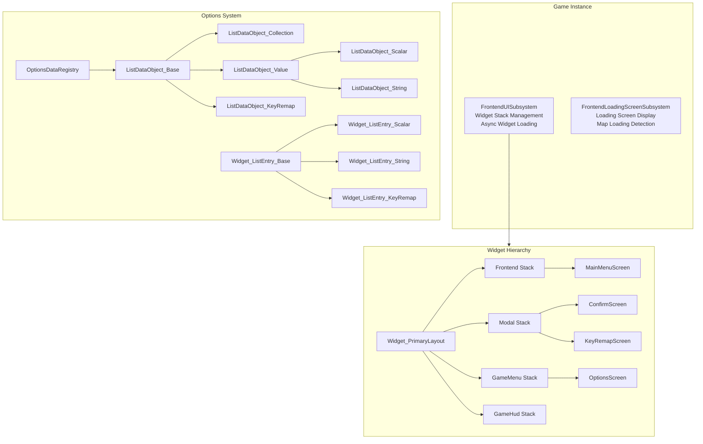
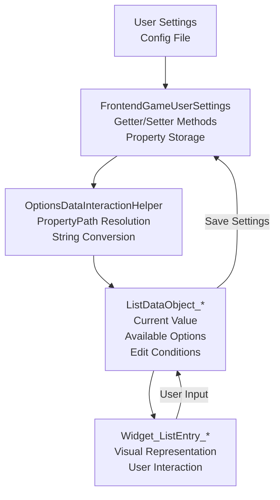
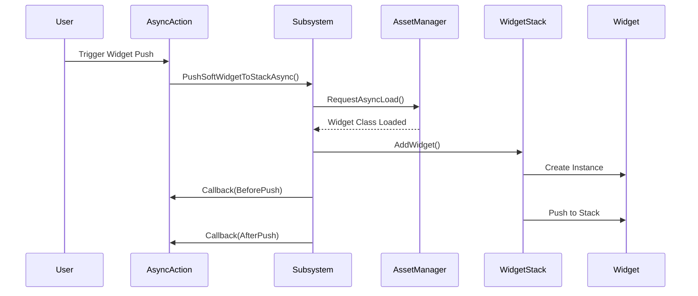

# UE5 Frontend UI System

A modular frontend UI system for Unreal Engine 5 built with CommonUI. Handles menus, settings screens, loading states, and key remapping with a clean, data-driven architecture.

## Features

- **Dynamic Options System** - Supports scalars, strings, booleans, enums, and resolutions
- **Widget Stack Management** - Organize UI with gameplay tag-based routing
- **Async Widget Loading** - Non-blocking UI operations
- **Loading Screen System** - Automatic loading state management
- **Key Remapping** - Full input customization for keyboard, mouse, and gamepad
- **Settings Persistence** - Automatic save/load via GameUserSettings
- **Edit Conditions** - Options can depend on other settings

## Architecture

### High-Level Overview



### Data Flow



### Widget Stack Flow



## Quick Start

### Requirements

- Unreal Engine 5.0+
- CommonUI Plugin
- EnhancedInput Plugin

### Setup

1. Copy `UE5_Frontend_UI` to your project's `Source` directory

2. Add to your `.uproject`:
```json
{
    "Modules": [
        {
            "Name": "UE5_Frontend_UI",
            "Type": "Runtime",
            "LoadingPhase": "Default"
        }
    ]
}
```

3. Configure in Project Settings:
   - Set Game User Settings Class to `FrontendGameUserSettings`
   - Map widget gameplay tags in Frontend UI Settings
   - Create Blueprint from `Widget_PrimaryLayout` and set as viewport

## Usage Examples

### Push a Widget

**C++:**
```cpp
UFrontendUISubsystem::Get(this)->PushSoftWidgetToStackAsync(
    FrontendGameplayTags::Frontend_WidgetStack_Modal,
    MyWidgetClass,
    [](EAsyncPushWidgetState State, UWidget_ActivatableBase* Widget) {
        if (State == EAsyncPushWidgetState::OnCreatedBeforePush) {
            Cast<UMyWidget>(Widget)->SetupData(MyData);
        }
    }
);
```

**Blueprint:**
```cpp
UAsyncAction_PushSoftWidget::PushSoftWidget(
    this, PlayerController, WidgetClass, StackTag, true
);
```

### Show Confirmation Dialog

```cpp
UFrontendUISubsystem::Get(this)->PushConfirmScreenToModelStackAsync(
    EConfirmScreenType::YesNo,
    FText::FromString("Delete Save"),
    FText::FromString("Are you sure?"),
    [](EConfirmScreenButtonType ButtonType) {
        if (ButtonType == EConfirmScreenButtonType::Confirmed) {
            DeleteSaveFile();
        }
    }
);
```

### Create Custom Option

```cpp
UListDataObject_Scalar* Option = NewObject<UListDataObject_Scalar>();
Option->SetDataID(FName("Volume"));
Option->SetDataDisplayName(FText::FromString("Master Volume"));
Option->SetDisplayValueRange(TRange<float>(0.f, 100.f));
Option->SetDataDynamicGetter(MAKE_OPTIONS_DATA_CONTROL(GetVolume));
Option->SetDataDynamicSetter(MAKE_OPTIONS_DATA_CONTROL(SetVolume));
```

## How It Works

The system uses a data-driven approach where UI options are separate from their visual representation. Options are defined as data objects that handle logic and state, while widgets simply display and interact with that data.

Widget stacks are organized by gameplay tags (Frontend, Modal, GameMenu, GameHud), making it easy to manage different UI layers. Everything loads asynchronously to keep your game responsive.

Settings automatically persist through the standard GameUserSettings system, and the property path reflection means you rarely need to write binding code manually.
