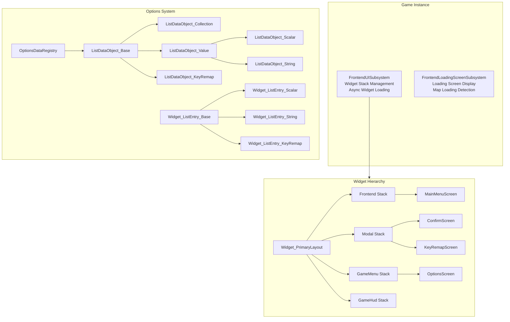
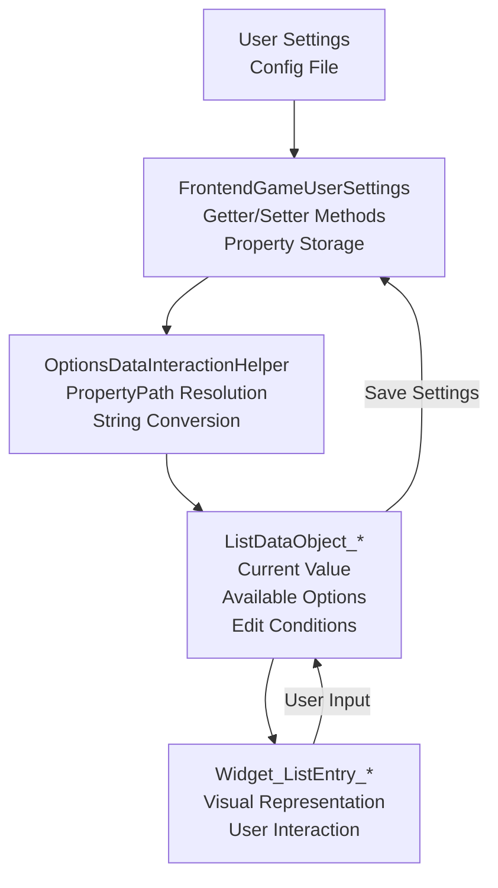
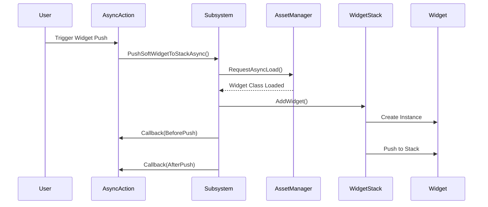

# UE5 Frontend UI System

A comprehensive, modular frontend UI system for Unreal Engine 5 built with CommonUI, featuring advanced options management, dynamic widget stacking, loading screens, and key remapping.

## 📋 Table of Contents

* [Overview](#overview)
* [Features](#features)
* [Architecture](#architecture)
* [Core Systems](#core-systems)
* [Code Structure](#code-structure)
* [Best Practices](#best-practices)
* [Getting Started](#getting-started)
* [Usage Examples](#usage-examples)
* [Dependencies](#dependencies)

---

## 🎯 Overview

This system provides a production-ready, scalable frontend UI framework for Unreal Engine 5 games. It implements a data-driven architecture with clear separation of concerns, making it easy to extend and maintain.

### Key Design Principles

* **Data-Driven**: Options and UI configurations are defined through data objects
* **Separation of Concerns**: Clear distinction between data, presentation, and logic
* **Modularity**: Easy to extend with new option types and widgets
* **Type Safety**: Strongly typed with C++ templates and enums
* **Async Operations**: Non-blocking UI operations with async actions

---

## ✨ Features

* ✅ **Dynamic Options System** with multiple data types (Scalar, String, Boolean, Enum, Resolution)
* ✅ **Widget Stack Management** with gameplay tag-based routing
* ✅ **Async Widget Loading** for improved performance
* ✅ **Custom Loading Screen System** with state management
* ✅ **Key Remapping** for keyboard, mouse, and gamepad
* ✅ **Edit Conditions & Dependencies** between options
* ✅ **Confirm Screens** (OK, Yes/No, OK/Cancel)
* ✅ **Settings Persistence** via GameUserSettings
* ✅ **Tab-Based Navigation** for organized settings
* ✅ **Accessibility Support** with proper focus management

---

## 🏗 Architecture

### High-Level Architecture Diagram



### Data Flow Diagram



### Widget Stack Flow



---

## 🔧 Core Systems

### 1. Widget Stack Management

The system uses **Gameplay Tags** to organize widgets into logical stacks:

* `Frontend.WidgetStack.Frontend` - Main menu screens
* `Frontend.WidgetStack.Modal` - Popup dialogs and confirmations
* `Frontend.WidgetStack.GameMenu` - In-game pause menus
* `Frontend.WidgetStack.GameHud` - HUD elements

**Key Classes:**
* `UFrontendUISubsystem` - Central management system
* `UWidget_PrimaryLayout` - Root widget containing all stacks
* `UAsyncAction_PushSoftWidget` - Async widget loading

### 2. Options System

#### Data Object Hierarchy

```cpp
UListDataObject_Base (Abstract)
├── DataID (FName)
├── DataDisplayName (FText)
├── DescriptionRichText (FText)
├── EditConditions (Array)
└── Dependencies (Array)
```

**Specialized Data Objects:**

1. **ListDataObject_Scalar** - Float values with ranges
   * Display/Output range mapping
   * Step size configuration
   * Numeric formatting options

2. **ListDataObject_String** - Dropdown selections
   * Dynamic option population
   * Display text separate from value
   * Support for enum wrappers

3. **ListDataObject_Collection** - Category/tab grouping
   * Hierarchical organization
   * Child data management

4. **ListDataObject_KeyRemap** - Input binding
   * Enhanced Input System integration
   * Per-input-device configurations
   * Reset to default support

#### Edit Conditions System

Options can have **conditional visibility/editability**:

```cpp
FOptionsDataEditConditionDescriptor Condition;
Condition.SetEditConditionFunc([]() -> bool {
    return WindowMode == Fullscreen;
});
Condition.SetDisabledRichReason("Only available in fullscreen");
Condition.SetDisabledForcedStringValue("DefaultValue");
```

### 3. Data-Driven Configuration

The system uses **property path reflection** to dynamically bind UI to settings:

```cpp
#define MAKE_OPTIONS_DATA_CONTROL(FuncName) \
    MakeShared<FOptionsDataInteractionHelper>( \
        GET_FUNCTION_NAME_STRING_CHECKED(UFrontendGameUserSettings, FuncName) \
    )

// Usage
DataObject->SetDataDynamicGetter(MAKE_OPTIONS_DATA_CONTROL(GetVolume));
DataObject->SetDataDynamicSetter(MAKE_OPTIONS_DATA_CONTROL(SetVolume));
```

This approach:
* ✅ Eliminates manual binding code
* ✅ Type-safe at compile time
* ✅ Automatically handles serialization
* ✅ Easy to add new options

### 4. Loading Screen System

**Components:**
* `UFrontendLoadingScreenSubsystem` - State management
* `FTickableGameObject` - Frame-by-frame updates
* Map load detection via delegates
* Texture streaming monitoring

**Loading Reasons Tracked:**
* Level loading
* World initialization
* Player controller creation
* Texture streaming

### 5. Async Actions (Blueprint Nodes)

Custom async Blueprint nodes for common operations:

```cpp
// Push widget asynchronously
UAsyncAction_PushSoftWidget::PushSoftWidget(
    WorldContext, PlayerController, WidgetClass, StackTag
);

// Show confirmation dialog
UAsyncAction_PushConfirmScreen::PushConfirmScreen(
    WorldContext, ScreenType, Title, Message
);
```

---

## 📁 Code Structure

```
UE5_Frontend_UI/
├── Source/
│   └── UE5_Frontend_UI/
│       ├── Private/
│       │   ├── AsyncActions/
│       │   │   ├── AsyncAction_PushConfirmScreen.cpp
│       │   │   └── AsyncAction_PushSoftWidget.cpp
│       │   ├── Controllers/
│       │   │   └── FrontendPlayerController.cpp
│       │   ├── FrontendSettings/
│       │   │   ├── FrontendDeveloperSettings.cpp
│       │   │   ├── FrontendGameUserSettings.cpp
│       │   │   └── FrontendLoadingScreenSettings.cpp
│       │   ├── Subsystems/
│       │   │   ├── FrontendLoadingScreenSubsystem.cpp
│       │   │   └── FrontendUISubsystem.cpp
│       │   ├── Widgets/
│       │   │   ├── Components/
│       │   │   │   ├── FrontendCommonButtonBase.cpp
│       │   │   │   ├── FrontendCommonListView.cpp
│       │   │   │   ├── FrontendCommonRotator.cpp
│       │   │   │   └── FrontendTabListWidgetBase.cpp
│       │   │   ├── Options/
│       │   │   │   ├── DataObjects/
│       │   │   │   │   ├── ListDataObject_Base.cpp
│       │   │   │   │   ├── ListDataObject_Collection.cpp
│       │   │   │   │   ├── ListDataObject_KeyRemap.cpp
│       │   │   │   │   ├── ListDataObject_Scalar.cpp
│       │   │   │   │   ├── ListDataObject_String.cpp
│       │   │   │   │   ├── ListDataObject_StringResolution.cpp
│       │   │   │   │   └── ListDataObject_Value.cpp
│       │   │   │   ├── ListEntries/
│       │   │   │   │   ├── Widget_ListEntry_Base.cpp
│       │   │   │   │   ├── Widget_ListEntry_KeyRemap.cpp
│       │   │   │   │   ├── Widget_ListEntry_Scalar.cpp
│       │   │   │   │   └── Widget_ListEntry_String.cpp
│       │   │   │   ├── OptionsDataInteractionHelper.cpp
│       │   │   │   ├── OptionsDataRegistry.cpp
│       │   │   │   ├── Widget_KeyRemapScreen.cpp
│       │   │   │   ├── Widget_OptionsDetailsView.cpp
│       │   │   │   └── Widget_OptionsScreen.cpp
│       │   │   ├── Widget_ActivatableBase.cpp
│       │   │   ├── Widget_ConfirmScreen.cpp
│       │   │   └── Widget_PrimaryLayout.cpp
│       │   ├── FrontendFunctionLibrary.cpp
│       │   └── FrontendGameplayTags.cpp
│       └── Public/
│           └── [Corresponding Headers]
```

---

## 🎨 Best Practices

### 1. Separation of Concerns

```cpp
// ✅ GOOD: Data separate from presentation
class UListDataObject_Scalar : public UListDataObject_Value {
    float GetCurrentValue() const;
    void SetCurrentValueFromSlider(float NewValue);
};

class UWidget_ListEntry_Scalar : public UWidget_ListEntry_Base {
    void OnOwningListDataObjectSet(UListDataObject_Base* DataObject);
    void OnOwningListDataObjectModified(/* ... */);
};
```

### 2. Factory Pattern for Object Creation

```cpp
// Confirm screen factory methods
UConfirmScreenInfoObject::CreateOKScreen(Title, Message);
UConfirmScreenInfoObject::CreateYesNoScreen(Title, Message);
UConfirmScreenInfoObject::CreateOkCancelScreen(Title, Message);
```

### 3. Observer Pattern for Updates

```cpp
// Data objects notify listeners of changes
DECLARE_MULTICAST_DELEGATE_TwoParams(FOnListDataModifiedDelegate, 
    TObjectPtr<UListDataObject_Base>, EOptionsListDataModifyReason)

// Widgets subscribe to data changes
DataObject->OnListDataModified.AddUObject(
    this, &UWidget_ListEntry_Base::OnOwningListDataObjectModified
);
```

### 4. Template Specialization

```cpp
// Type-safe enum options
template<typename EnumType>
void AddEnumOption(EnumType InEnumOption, const FText& InDisplayText) {
    const UEnum* StaticEnumOption = StaticEnum<EnumType>();
    const FString ConvertedEnumString = 
        StaticEnumOption->GetNameStringByValue(InEnumOption);
    AddDynamicOption(ConvertedEnumString, InDisplayText);
}
```

### 5. RAII and Smart Pointers

```cpp
// Proper cleanup in input processor
void UWidget_KeyRemapScreen::NativeOnDeactivated() {
    if (CachedInputPreprocessor) {
        FSlateApplication::Get().UnregisterInputPreProcessor(
            CachedInputPreprocessor
        );
        CachedInputPreprocessor.Reset();
    }
}
```

### 6. Delegate-Based Callbacks

```cpp
// Async operations with callbacks
PushSoftWidgetToStackAsync(
    StackTag, WidgetClass,
    [](EAsyncPushWidgetState State, UWidget_ActivatableBase* Widget) {
        if (State == EAsyncPushWidgetState::OnCreatedBeforePush) {
            // Initialize widget before push
        }
    }
);
```

### 7. Validation and Error Checking

```cpp
// Editor-time validation
#if WITH_EDITOR
void ValidateCompiledDefaults(IWidgetCompilerLog& CompileLog) const override {
    if (!DataListEntryMapping) {
        CompileLog.Error(FText::FromString(
            "DataListEntryMapping has no valid data asset assigned"
        ));
    }
}
#endif
```

---

## 🚀 Getting Started

### Prerequisites

* Unreal Engine 5.0+
* CommonUI Plugin enabled
* EnhancedInput Plugin enabled

### Installation

1. Copy the `UE5_Frontend_UI` folder to your project's `Source` directory
2. Add the module to your `.uproject` file:

```json
{
    "Modules": [
        {
            "Name": "UE5_Frontend_UI",
            "Type": "Runtime",
            "LoadingPhase": "Default"
        }
    ]
}
```

3. Regenerate project files and compile

### Configuration

1. **Set Game User Settings Class**
   * Project Settings → Game → Game User Settings Class
   * Set to `FrontendGameUserSettings`

2. **Configure Widget Mappings**
   * Project Settings → Frontend UI Settings
   * Map Gameplay Tags to Widget Classes

3. **Setup Primary Layout**
   * Create Blueprint based on `Widget_PrimaryLayout`
   * Register widget stacks with appropriate tags
   * Set as viewport in GameMode or PlayerController

---

## 📖 Usage Examples

### Creating a Custom Option

```cpp
// In OptionsDataRegistry
UListDataObject_Scalar* CustomOption = NewObject<UListDataObject_Scalar>();
CustomOption->SetDataID(FName("MyOption"));
CustomOption->SetDataDisplayName(FText::FromString("My Custom Option"));
CustomOption->SetDisplayValueRange(TRange<float>(0.f, 100.f));
CustomOption->SetOutputValueRange(TRange<float>(0.f, 1.f));
CustomOption->SetDataDynamicGetter(
    MAKE_OPTIONS_DATA_CONTROL(GetMyCustomValue)
);
CustomOption->SetDataDynamicSetter(
    MAKE_OPTIONS_DATA_CONTROL(SetMyCustomValue)
);
CustomOption->SetDefaultValueFromString(LexToString(50.f));
```

### Pushing a Widget to Stack

**C++ Async:**

```cpp
UFrontendUISubsystem::Get(this)->PushSoftWidgetToStackAsync(
    FrontendGameplayTags::Frontend_WidgetStack_Modal,
    MyWidgetClass,
    [](EAsyncPushWidgetState State, UWidget_ActivatableBase* Widget) {
        if (State == EAsyncPushWidgetState::OnCreatedBeforePush) {
            // Configure widget before showing
            Cast<UMyWidget>(Widget)->SetupData(MyData);
        }
    }
);
```

**Blueprint:**

```cpp
UAsyncAction_PushSoftWidget* Action = UAsyncAction_PushSoftWidget::PushSoftWidget(
    this, PlayerController, WidgetClass, StackTag, true
);
Action->OnWidgetCreatedBeforePush.AddDynamic(this, &AMyClass::OnWidgetCreated);
Action->Activate();
```

### Showing Confirmation Dialog

```cpp
UFrontendUISubsystem::Get(this)->PushConfirmScreenToModelStackAsync(
    EConfirmScreenType::YesNo,
    FText::FromString("Delete Save"),
    FText::FromString("Are you sure you want to delete this save file?"),
    [](EConfirmScreenButtonType ButtonType) {
        if (ButtonType == EConfirmScreenButtonType::Confirmed) {
            // User clicked Yes
            DeleteSaveFile();
        }
    }
);
```

### Adding Edit Dependencies

```cpp
UListDataObject_String* OptionA = NewObject<UListDataObject_String>();
UListDataObject_Scalar* OptionB = NewObject<UListDataObject_Scalar>();

// OptionB depends on OptionA
FOptionsDataEditConditionDescriptor Condition;
Condition.SetEditConditionFunc([OptionA]() -> bool {
    return OptionA->GetCurrentDisplayText().ToString() == "Enabled";
});
Condition.SetDisabledRichReason(
    "<Disabled>This option requires OptionA to be Enabled</>"
);

OptionB->AddEditCondition(Condition);
OptionB->AddEditDependencyData(OptionA);
```

---

## 📦 Dependencies

### Unreal Engine Modules

```cpp
PublicDependencyModuleNames.AddRange(new string[]
{
    "Core",
    "CoreUObject",
    "Engine",
    "InputCore",
    "GameplayTags",
    "UMG",
    "CommonInput",
    "CommonUI",
    "PropertyPath",
    "EnhancedInput",
    "PreLoadScreen",
    "Slate",
    "SlateCore"
});
```

### Plugins Required

* CommonUI
* EnhancedInput
* CommonInput

---

## 🔍 Advanced Topics

### Custom List Entry Widget

1. Create data object class inheriting from `UListDataObject_Base`
2. Create widget class inheriting from `UWidget_ListEntry_Base`
3. Map them in `DataAsset_DataListEntryMapping`
4. Override `OnOwningListDataObjectSet()` to bind data

### Input Preprocessing

The key remap screen uses custom input preprocessing:

```cpp
class FKeyRemapScreenInputPreprocessor : public IInputProcessor {
    virtual bool HandleKeyDownEvent(FSlateApplication&, const FKeyEvent&);
    virtual bool HandleMouseButtonDownEvent(FSlateApplication&, const FPointerEvent&);
    
    // Filters input by device type
    // Validates against gameplay requirements
    // Handles cancellation (ESC key)
};
```

### Subsystem Pattern

Both `UFrontendUISubsystem` and `UFrontendLoadingScreenSubsystem` implement:

```cpp
virtual bool ShouldCreateSubsystem(UObject* Outer) const override {
    // Only create in non-dedicated server instances
    // Ensure no derived classes exist (singleton pattern)
}
```
