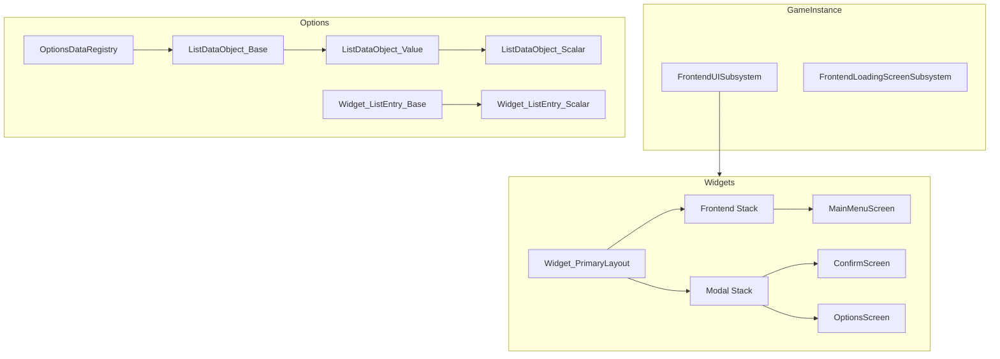

# UE5 Frontend UI System

A modular frontend UI framework for Unreal Engine 5 built on CommonUI. Handles options menus, widget stack management, loading screens, and input remapping.

## What This Is

I got tired of rebuilding the same UI infrastructure for every UE5 project, so I made this. It's a reusable system for handling all the annoying parts of game UI: settings screens, widget routing, async loading, and making sure your loading screens actually show up when you need them.

The core idea is data-driven options. You define your settings once, and the UI builds itself from that data. Want to add a new graphics option? Create a data object, point it at your getter/setter, done.

## Main Features

- **Options system** that supports scalars, dropdowns, booleans, and resolution pickers
- **Widget stack management** using gameplay tags for routing
- **Async widget loading** so you don't freeze the game loading menus
- **Loading screen system** that actually works (harder than it sounds)
- **Key remapping** for keyboard, mouse, and gamepad
- **Edit conditions** so options can show/hide based on other settings
- **Confirmation dialogs** (OK, Yes/No, OK/Cancel)
- **Settings persistence** through GameUserSettings
- **Tab navigation** for organizing settings into categories

## Why I Built It This Way

### Data-Driven Architecture

The old way of doing UI in Unreal is to manually wire up every button and slider. That gets old fast. This system uses data objects to define options, then automatically generates the UI from those definitions.

```cpp
// This is all you need to add a new option
UListDataObject_Scalar* VolumeOption = NewObject<UListDataObject_Scalar>();
VolumeOption->SetDataID(FName("MasterVolume"));
VolumeOption->SetDataDisplayName(FText::FromString("Master Volume"));
VolumeOption->SetDataDynamicGetter(MAKE_OPTIONS_DATA_CONTROL(GetMasterVolume));
VolumeOption->SetDataDynamicSetter(MAKE_OPTIONS_DATA_CONTROL(SetMasterVolume));
```

The macro `MAKE_OPTIONS_DATA_CONTROL` uses reflection to find your getter/setter functions. It's type-safe at compile time, which saves you from typos and refactoring headaches.

### Widget Stack Tags

Instead of hardcoding widget relationships, I use gameplay tags to organize them:

- `Frontend.WidgetStack.Frontend` - Main menu stuff
- `Frontend.WidgetStack.Modal` - Popups and dialogs
- `Frontend.WidgetStack.GameMenu` - Pause menus
- `Frontend.WidgetStack.GameHud` - HUD elements

This makes it easy to push/pop widgets without tight coupling. Want to show a confirmation dialog? Just push it to the Modal stack. The system handles focus, input mode, and cleanup automatically.

### Async Everything

Loading widgets synchronously is a great way to get hitches. This system loads everything async by default:

```cpp
UFrontendUISubsystem::Get(this)->PushSoftWidgetToStackAsync(
    FrontendGameplayTags::Frontend_WidgetStack_Modal,
    MyWidgetClass,
    [](EAsyncPushWidgetState State, UWidget_ActivatableBase* Widget) {
        if (State == EAsyncPushWidgetState::OnCreatedBeforePush) {
            // Initialize widget data here
        }
    }
);
```

The callback fires at different stages so you can configure the widget before it appears.

## Architecture Overview

Here's how the pieces fit together:



The `FrontendUISubsystem` manages all widget operations. It sits in the GameInstance, so it persists across level loads. The `Widget_PrimaryLayout` is the root widget that contains all your stacks.

## How Options Work

Options use an observer pattern. Data objects hold the actual values, and widgets observe those objects for changes:

1. User moves a slider
2. Widget calls `DataObject->SetCurrentValue()`
3. Data object updates and broadcasts a change event
4. All listening widgets update their display
5. Data object saves to `GameUserSettings`

This decouples the UI from the data. You can have multiple widgets showing the same option, and they all stay in sync.

### Edit Conditions

Options can be conditional. For example, "VSync" only makes sense in fullscreen mode:

```cpp
FOptionsDataEditConditionDescriptor Condition;
Condition.SetEditConditionFunc([WindowModeOption]() -> bool {
    return WindowModeOption->GetCurrentValue() == "Fullscreen";
});
Condition.SetDisabledRichReason("Only available in fullscreen mode");

VSyncOption->AddEditCondition(Condition);
VSyncOption->AddEditDependencyData(WindowModeOption);
```

When the window mode changes, VSync automatically enables/disables itself. The reason text shows up in a tooltip.

## Loading Screen System

Getting loading screens to work properly in UE5 is surprisingly annoying. The `FrontendLoadingScreenSubsystem` handles this by:

- Listening for map load events
- Monitoring texture streaming
- Tracking world initialization
- Using a `FTickableGameObject` to update per-frame

It shows the loading screen when any of these conditions are active, and hides it when they're all done. This catches edge cases like late-streaming textures that would otherwise show a black screen.

## Code Structure

```
UE5_Frontend_UI/
├── Private/
│   ├── AsyncActions/
│   │   ├── AsyncAction_PushConfirmScreen.cpp
│   │   └── AsyncAction_PushSoftWidget.cpp
│   ├── FrontendSettings/
│   │   ├── FrontendGameUserSettings.cpp
│   │   └── FrontendLoadingScreenSettings.cpp
│   ├── Subsystems/
│   │   ├── FrontendLoadingScreenSubsystem.cpp
│   │   └── FrontendUISubsystem.cpp
│   ├── Widgets/
│   │   ├── Options/
│   │   │   ├── DataObjects/
│   │   │   │   ├── ListDataObject_Base.cpp
│   │   │   │   ├── ListDataObject_Scalar.cpp
│   │   │   │   ├── ListDataObject_String.cpp
│   │   │   │   └── ListDataObject_KeyRemap.cpp
│   │   │   └── ListEntries/
│   │   │       ├── Widget_ListEntry_Base.cpp
│   │   │       ├── Widget_ListEntry_Scalar.cpp
│   │   │       └── Widget_ListEntry_String.cpp
│   │   ├── Widget_ConfirmScreen.cpp
│   │   └── Widget_PrimaryLayout.cpp
│   └── FrontendGameplayTags.cpp
└── Public/
    └── [Headers]
```

## Getting Started

### Requirements

- Unreal Engine 5.0+
- CommonUI plugin
- EnhancedInput plugin

### Setup

1. Copy `UE5_Frontend_UI` to your project's `Source` directory

2. Add to your `.uproject`:

```json
{
    "Modules": [
        {
            "Name": "UE5_Frontend_UI",
            "Type": "Runtime",
            "LoadingPhase": "Default"
        }
    ]
}
```

3. Regenerate project files and compile

4. In Project Settings → Game, set Game User Settings Class to `FrontendGameUserSettings`

5. Create a Blueprint based on `Widget_PrimaryLayout` and add it to your viewport

## Usage Examples

### Adding a Custom Option

```cpp
UListDataObject_Scalar* CustomOption = NewObject<UListDataObject_Scalar>();
CustomOption->SetDataID(FName("MyOption"));
CustomOption->SetDataDisplayName(FText::FromString("My Custom Option"));
CustomOption->SetDisplayValueRange(TRange<float>(0.f, 100.f));
CustomOption->SetOutputValueRange(TRange<float>(0.f, 1.f));
CustomOption->SetDataDynamicGetter(MAKE_OPTIONS_DATA_CONTROL(GetMyCustomValue));
CustomOption->SetDataDynamicSetter(MAKE_OPTIONS_DATA_CONTROL(SetMyCustomValue));
CustomOption->SetDefaultValueFromString(LexToString(50.f));
```

### Showing a Confirmation Dialog

```cpp
UFrontendUISubsystem::Get(this)->PushConfirmScreenToModelStackAsync(
    EConfirmScreenType::YesNo,
    FText::FromString("Delete Save"),
    FText::FromString("Are you sure?"),
    [](EConfirmScreenButtonType ButtonType) {
        if (ButtonType == EConfirmScreenButtonType::Confirmed) {
            DeleteSaveFile();
        }
    }
);
```

### Pushing a Widget Async (C++)

```cpp
UFrontendUISubsystem::Get(this)->PushSoftWidgetToStackAsync(
    FrontendGameplayTags::Frontend_WidgetStack_Modal,
    MyWidgetClass,
    [](EAsyncPushWidgetState State, UWidget_ActivatableBase* Widget) {
        if (State == EAsyncPushWidgetState::OnCreatedBeforePush) {
            Cast<UMyWidget>(Widget)->SetupData(MyData);
        }
    }
);
```

### Pushing a Widget Async (Blueprint)

Use the `PushSoftWidget` async action node. It has callbacks for different stages of the widget lifecycle.

## Things to Watch Out For

### Property Path Reflection

The `MAKE_OPTIONS_DATA_CONTROL` macro uses reflection to find getter/setter functions. This means:

- Function names must match exactly (case-sensitive)
- Functions must be `UFUNCTION()` marked
- Renaming functions will break at runtime, not compile time

I've considered switching to a delegate-based approach, but the convenience of the macro outweighs the slight brittleness for now.

### Loading Screen Timing

The loading screen subsystem is pretty robust, but it can have issues if you manually call `OpenLevel` in unusual ways. It expects the standard `UGameplayStatics::OpenLevel` flow. If you're doing custom map loading, you might need to manually trigger `ShowLoadingScreen()`.

### Widget Stack Lifecycle

CommonUI's activatable widget system has specific lifecycle expectations. Make sure you're calling `ActivateWidget()` and `DeactivateWidget()` properly, especially if you're manually managing widgets instead of using the stack system.

## Dependencies

The system requires these Unreal modules:

- Core, CoreUObject, Engine (standard)
- GameplayTags (for stack routing)
- UMG, Slate, SlateCore (UI)
- CommonUI, CommonInput (UI framework)
- EnhancedInput (input system)
- PropertyPath (reflection)
- PreLoadScreen (loading screen API)

Make sure CommonUI and EnhancedInput plugins are enabled in your project.

## What I'd Do Differently

If I were starting from scratch today:

- **Use Enhanced Input Actions directly** instead of wrapping them. The current key remap system works but adds a layer of indirection.
- **Better separation of settings storage**. Right now everything goes through `GameUserSettings`, which can get messy. A separate config system might be cleaner.
- **More granular callbacks** for widget lifecycle events. The current system is a bit coarse.
- **Better error messages**. When you misconfigure something, the errors aren't always helpful.

That said, the system works well for what it does. It's saved me a ton of time across multiple projects.

## License

Do whatever you want with this code. Attribution appreciated but not required.
