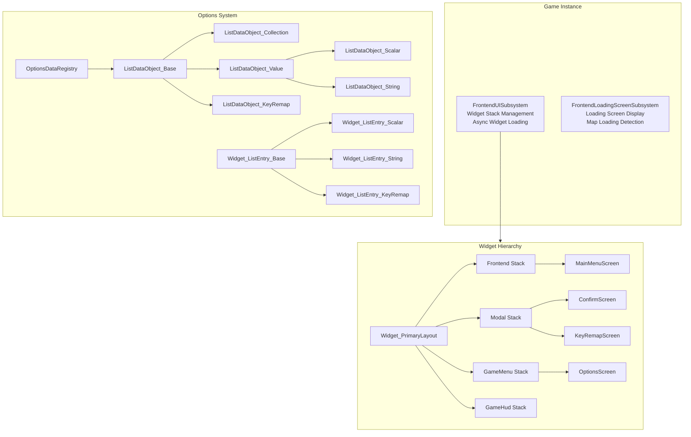
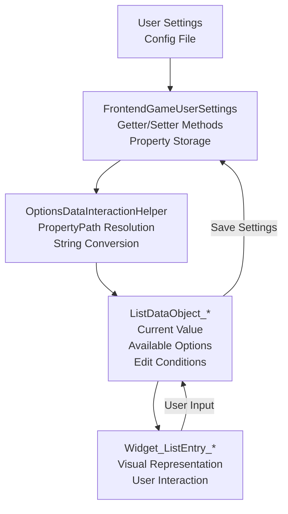
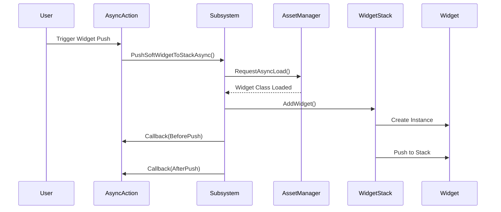

# UE5 Frontend UI System

A modular frontend UI framework for Unreal Engine 5 games, built on CommonUI with support for dynamic options, widget stacking, loading screens, and input remapping.

## What This Is

This is a production UI system I built to handle the common patterns you see in modern game frontends - main menus, settings screens, confirmation dialogs, and loading transitions. It's designed to be data-driven so you can add new options without writing a bunch of boilerplate code.

The key idea is separating your data (what the settings actually are) from presentation (how they look) and logic (how they behave). This makes everything easier to maintain and extend.

## Core Features

- **Options system** supporting multiple types (sliders, dropdowns, booleans, enums, resolutions)
- **Widget stack management** using gameplay tags to organize different UI layers
- **Async widget loading** so your UI doesn't block the game thread
- **Loading screen system** with proper state tracking
- **Key remapping** for keyboard, mouse, and gamepad inputs
- **Conditional options** that show/hide based on other settings
- **Settings persistence** through GameUserSettings

## Architecture

Here's how the main systems connect:



### How Data Flows

Settings changes flow through a clean pipeline from config files to the UI and back:



### Widget Stack Flow

Widgets load asynchronously so you don't get hitches when opening menus:



## How It Works

### Widget Stacks

Widgets are organized into different stacks using gameplay tags:

- `Frontend.WidgetStack.Frontend` - Your main menu screens
- `Frontend.WidgetStack.Modal` - Pop-ups and confirmation dialogs
- `Frontend.WidgetStack.GameMenu` - In-game pause menus
- `Frontend.WidgetStack.GameHud` - HUD overlays

The `UFrontendUISubsystem` manages all of this, and `UWidget_PrimaryLayout` is the root widget that contains everything.

### Options System

Options are built from data objects that inherit from `UListDataObject_Base`. Each type handles its own data:

- **ListDataObject_Scalar** - Float sliders with min/max ranges
- **ListDataObject_String** - Dropdown menus
- **ListDataObject_Collection** - Category groupings for tabs
- **ListDataObject_KeyRemap** - Input binding controls

The neat part is the property path reflection system. Instead of manually wiring up getters and setters, you can do this:

```cpp
#define MAKE_OPTIONS_DATA_CONTROL(FuncName) \
    MakeShared<FOptionsDataInteractionHelper>( \
        GET_FUNCTION_NAME_STRING_CHECKED(UFrontendGameUserSettings, FuncName) \
    )

DataObject->SetDataDynamicGetter(MAKE_OPTIONS_DATA_CONTROL(GetVolume));
DataObject->SetDataDynamicSetter(MAKE_OPTIONS_DATA_CONTROL(SetVolume));
```

This automatically handles type conversion and serialization for you.

### Edit Conditions

Options can depend on other options. For example, you might only want to show V-Sync settings when the player is in fullscreen mode:

```cpp
FOptionsDataEditConditionDescriptor Condition;
Condition.SetEditConditionFunc([]() -> bool {
    return WindowMode == Fullscreen;
});
Condition.SetDisabledRichReason("Only available in fullscreen");
```

### Loading Screens

The loading screen subsystem implements `FTickableGameObject` and tracks multiple loading reasons (map loading, world initialization, texture streaming). It shows the loading screen when any reason is active and hides it when all are cleared.

## Project Structure

```
Source/UE5_Frontend_UI/
├── Private/
│   ├── AsyncActions/          # Async Blueprint nodes
│   ├── Controllers/           # Player controller implementations
│   ├── FrontendSettings/      # Config and user settings
│   ├── Subsystems/            # UI and loading screen subsystems
│   └── Widgets/
│       ├── Components/        # Reusable UI components
│       └── Options/
│           ├── DataObjects/   # Option data classes
│           └── ListEntries/   # Option widget classes
└── Public/                    # Header files
```

## Dependencies

You'll need these UE5 modules:
- Core, CoreUObject, Engine, InputCore
- GameplayTags, UMG
- CommonUI, CommonInput, EnhancedInput
- PropertyPath, Slate, SlateCore

Make sure the CommonUI, EnhancedInput, and CommonInput plugins are enabled in your project.

## Design Patterns Used

The code follows some common patterns that make it maintainable:

- **Observer pattern** for data changes (widgets subscribe to updates)
- **Factory pattern** for creating confirm screens and data objects
- **Template specialization** for type-safe enum handling
- **RAII and smart pointers** for proper cleanup
- **Delegate-based callbacks** for async operations

There's also editor-time validation to catch configuration errors before runtime.

---

Built for UE5 projects that need a solid, extensible frontend UI foundation without reinventing the wheel every time.
